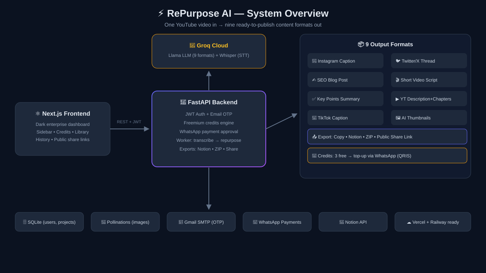
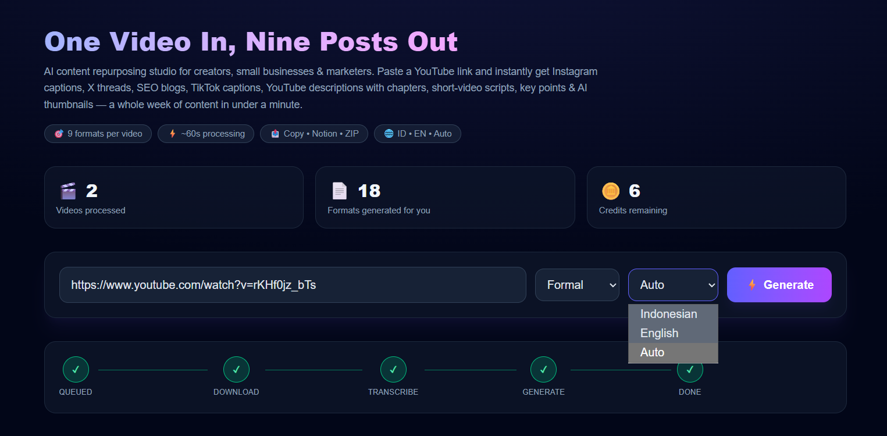

<div align="center">

# RePurpose AI

### **One Video In, Nine Posts Out.**

AI content repurposing studio for creators, small businesses & marketers.
Paste a YouTube link → get **9 ready-to-publish formats** in under a minute.




</div>
---

## 🖥️ Product Preview

### Enterprise Dark Dashboard
<p align="center">
  
</p>

<p align="center"><em>
Personal stats yang hidup • pipeline stepper real-time • 9 format per video •
sistem kredit & top-up • sidebar navigasi profesional — semua dalam satu layar.
</em>
</p>
---

🔗 **Live Demo:** [https://repurpose-ai-web-eight.vercel.app](https://repurpose-ai-web-eight.vercel.app)

## ✨** Feature**

| Category | Details |
|---|---|
| 🎯 **9 AI Formats** | Instagram Caption, Twitter/X Thread, SEO Blog Post, Short Video Script, Key Points Summary, YouTube Description **+ auto Chapters**, TikTok Caption, AI Thumbnail Ideas (+ generated images) |
| 🌐 **Multi-language** | Indonesian, English, or Auto-detect • 3 tone presets (Formal / Casual / Marketing) |
| 🎬 **Smart Pipeline** | YouTube subtitles → fallback audio download → Whisper transcription → smart-cut transcript → timeline-aware chapter generation |
| 🔐 **Full Auth System** | Register + **email OTP verification**, login, Google OAuth, forgot password via email code, JWT sessions, "remember me" |
| 💎 **Freemium Credits** | 3 free credits on signup • 1 credit per generation • top-up packages (+5 / +15 / +30 / +100) |
| 💬 **WhatsApp Payments** | Zero-dependency payment flow: order → transfer (QRIS/e-wallet/bank) → confirm via WhatsApp → one-tap admin approval → credits auto-added |
| 📤 **Export Channels** | Copy to clipboard • **Notion** (full page + embedded images) • **ZIP pack** (Markdown files + thumbnails) • **Public share link** (viral loop) |
| 🗂️ **Content Library** | Browse every AI output across all projects, filterable by platform |
| 📈 **Personal Stats** | Videos processed, formats generated, credits remaining — live on the dashboard |
| 🏢 **Enterprise UI** | Dark glassmorphism dashboard, sidebar navigation, pipeline stepper, responsive mobile sidebar |


## ️ Architecture

```
YouTube URL ──▶ FastAPI Backend ──▶ Groq (Llama LLM + Whisper)
                    │  ├─ subtitle fetch (youtube-transcript-api)
                    │  ├─ fallback: yt-dlp audio download → Whisper STT
                    │  ├─ Pollinations (AI thumbnails)
                    │  ├─ SQLite (users, projects, payments)
                    │  ├─ Gmail SMTP (OTP emails)
                    │  └─ Notion API / ZIP / share links
                    ▼
              Next.js 16 Dark Dashboard (sidebar, credits, library, history)
```


## Struktur Repository

- `backend/` — kode server, layanan, dan workers
  - `app/` — modul aplikasi FastAPI
  - `services/` — layanan modular (transcriber, thumbnail, mailer, dll.)
  - `workers/` — tugas latar belakang
  - `requirements.txt` — dependensi Python
- `frontend/` — aplikasi Next.js untuk UI
 **AI:** Groq (Llama 3.3 70B + Whisper large-v3), Pollinations (image gen)
- **Auth:** JWT (PyJWT), PBKDF2 password hashing, HMAC approval tokens
- **Integrations:** YouTube (yt-dlp + transcript API), Notion API, Gmail SMTP, WhatsApp deep-links

## 🚀 Getting Started

### Prerequisites
- Python 3.11+ • Node.js 18+ • (optional) Groq API key, Gmail App Password
- Git
- (Opsional) Docker untuk containerized deployment
### 1) Backend

```bash
cd backend
python -m venv venv
# Windows: venv\Scripts\activate | Linux/Mac: source venv/bin/activate
pip install -r requirements.txt

copy .env.example .env     # Windows (or: cp .env.example .env)
# → fill in your keys (see Environment section)

uvicorn app.main:app --reload --port 8000
```

### 2) Frontend

```bash
cd frontend
npm install
npm run dev
# open http://localhost:3000
```
## Konfigurasi Lingkungan

1. Salin contoh file environment bila ada: `.env.example` → `.env` atau `.env.local`.
2. Isi variabel environment yang diperlukan, misalnya:
   - `SECRET_KEY`
   - `DATABASE_URL`
   - `OPENAI_API_KEY` (jika digunakan)
   - `NOTION_API_KEY` (jika integrasi Notion diperlukan)
   - `SMTP_HOST`, `SMTP_USER`, `SMTP_PASS` (untuk email)
   - Kunci storage/S3 atau credential cloud jika diperlukan
| Variable | Purpose |
|---|---|
| `OPENAI_API_KEY` / `OPENAI_BASE_URL` / `LLM_MODEL` | Groq LLM + Whisper |
| `JWT_SECRET` | Session token signing |
| `SMTP_USER` / `SMTP_PASS` | Gmail SMTP for OTP emails (empty = dev mode: code printed in terminal) |
| `GOOGLE_CLIENT_ID` / `GOOGLE_CLIENT_SECRET` | Google OAuth login |
| `NOTION_TOKEN` / `NOTION_PARENT_PAGE_ID` | Notion export |
| `WA_OWNER_NUMBER` / `PAYMENT_INFO` / `BACKEND_PUBLIC_URL` | WhatsApp payment flow |
| `NEXT_PUBLIC_API_URL` *(frontend)* | Backend base URL |

Catatan: Lokasi dan nama variabel bisa berbeda di implementasi. Periksa [backend/app/config.py](backend/app/config.py#L1) untuk daftar variabel aktual.

## 📁 Project Structure

```
├── backend/
│   ├── app/
│   │   ├── main.py            # FastAPI routes (auth, projects, payments, exports)
│   │   ├── models.py          # User, Project, Payment (SQLAlchemy)
│   │   ├── config.py          # Pydantic settings (.env)
│   │   ├── services/          # auth, repurposer, transcriber, downloader,
│   │   │                      # thumbnail, notion_export, pack_export, payment, mailer
│   │   └── workers/tasks.py   # async processing pipeline
│   └── requirements.txt
└── frontend/
    └── app/
        ├── dashboard/  login/  history/  library/  share/[pid]/
        ├── components/ (Sidebar, cards)
        └── lib/auth.ts
```
## 🗺️ Roadmap

- [ ] payment-option
- [ ] Bulk & playlist processing
- [ ] Podcast/audio upload input
- [ ] Thumbnail text-overlay compositor (PIL)
- [ ] Team workspaces & brand-voice profiles

```
## 👤 Author

Built with 🔥by Salimz

> ⚠️ **Disclaimer:** This tool respects YouTube's Terms of Service — it only processes
> publicly available metadata/subtitles or audio you have rights to. AI-generated
> content should be reviewed before publishing. Credits & payments are handled
> manually by the operator in the WhatsApp flow.
